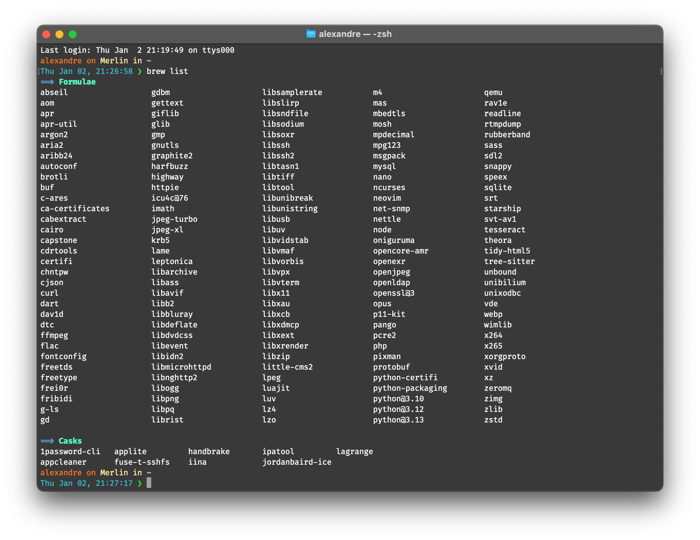

# My applications for macOS
> 💡 All these apps won't be installed by [the script](../installation%20script/post_install.sh).

<!-- TOC START min:1 max:4 link:true update:true -->
- [My applications for macOS](#my-applications-for-macos)
  - [Mac App Store](#mac-app-store)
  - [Homebrew](#homebrew)
    - [Cask (Internet)](#cask-internet)
      - [Apps](#apps)
      - [Fonts](#fonts)
      - [QuickLook Plugins](#quicklook-plugins)
  - [Internet](#internet)
  - [Extensions Safari](#extensions-safari)

<!-- TOC END -->

## Mac App Store

- [1Blocker - Block ads, tracking scripts, anything](https://1blocker.com)
- [Affinity Designer](https://affinity.serif.com/en-gb/designer/)
- Better Rename 10
- [Calendarique](https://www.imagetasks.com/calendar-widget-for-osx/)
<!--
>- [CloudMounter: encrypt cloud files, save disk space](https://mac.eltima.com/mount-cloud-drive.html)
>-->
- [Drop - Color Picker](http://dropcolorpicker.com)
- eBookBinder
- [Expressions](http://www.apptorium.com/products/expressions)
- [GoodNotes](http://www.goodnotesapp.com)
- [Image2icon - Make your own icons](http://www.img2icnsapp.com)
- [iWork](https://www.apple.com/iwork/)
    - Keynote
    - Numbers
    - Pages
- [Notability](http://gingerlabs.com)
- [Paste – smart clipboard history & snippets manager](http://pasteapp.me)
- [Pixelmator](http://www.pixelmator.com/mac/)
- [Quiver: The Programmer's Notebook](http://happenapps.com)
- RulerSwift
- [Snipposé](http://www.samuelwford.com/snippose)
- StuffIt 16
- [Svgsus](http://www.svgs.us)
- [Textastic](https://www.textasticapp.com/mac.html)
- [Wire — Private Messenger](https://wire.com/en/)
- [Wunderlist](https://www.wunderlist.com)
- [Xcode](https://developer.apple.com/xcode/)

## Homebrew
[Back to the beginning](#my-applications-for-macos)

> To have some infos on the package (version,…), you can use this line before intalling:
> ```brew info packageName```

- [Ant](https://ant.apache.org) - ```brew install ant```
    <!-- > Apache Ant is a Java library and command-line tool whose mission is to drive processes described in build files as targets and extension points dependent upon each other. -->
- [aria2](https://aria2.github.io) - ```brew install aria2```
    <!-- > aria2 is a lightweight multi-protocol & multi-source command-line download utility. It supports HTTP/HTTPS, FTP, SFTP, BitTorrent and Metalink. aria2 can be manipulated via built-in JSON-RPC and XML-RPC interfaces. -->
- [Bash-Completion](https://github.com/scop/bash-completion) - ```brew install bash-completion```
    <!-- > Programmable completion functions for bash -->
    - [mycli](https://www.mycli.net) - ```brew install mycli```
        <!-- > MyCLI is a command line interface for MySQL, MariaDB, and Percona with auto-completion and syntax highlighting. -->
- [Cask](https://caskroom.github.io) - ```brew tap caskroom/cask```
    <!-- > Homebrew-Cask extends Homebrew and brings its elegance, simplicity, and speed to macOS applications and large binaries alike. -->
- [CLISP](http://clisp.org) - ```brew install clisp```
    <!-- > This is GNU CLISP - an ANSI Common Lisp Implementation -->
- [Dnsmasq](http://www.thekelleys.org.uk/dnsmasq/doc.html) - ```brew install dnsmasq```
    <!-- > Dnsmasq provides network infrastructure for small networks: DNS, DHCP, router advertisement and network boot. It is designed to be lightweight and have a small footprint, suitable for resource constrained routers and firewalls. -->
- [Exercism](http://exercism.io) - ```brew install exercism```
    <!-- > Level up your programming skills -->
    - **Configuration:** _exercism configure --key=YOUR_API_KEY_
    - **Setting up Exercism CLI completion:**
        - **Install:**
        ```bash
        mkdir -p ~/.config/exercism/
        curl http://cli.exercism.io/exercism_completion.bash > ~/.config/exercism/exercism_completion.bash
        ```
        - **Add to ```.bash_profile```:**
        ```
        if [ -f ~/.config/exercism/exercism_completion.bash ]; then
            - ~/.config/exercism/exercism_completion.bash
        fi
        ```
- [ExifTool](http://owl.phy.queensu.ca/~phil/exiftool/) - ```brew install exiftool```
    <!-- > Read, Write and Edit Meta Information! -->
- [FFmpeg](https://www.ffmpeg.org) - ```brew install ffmpeg```
    <!-- > FFmpeg is the leading multimedia framework, able to decode, encode, transcode, mux, demux, stream, filter and play pretty much anything that humans and machines have created. -->
- [Caskroom-fonts](https://github.com/caskroom/homebrew-fonts) -  ```brew tap caskroom/fonts```
    <!-- > Caskroom-fonts is a Homebrew Tap which allows you to use the same friendly Homebrew-style CLI workflow for the administration of binary font files on your Mac. -->
- [git](https://git-scm.com) - ```brew install git```
- [git-flow](https://github.com/nvie/gitflow) - ```brew install git-flow```
    <!-- > A collection of Git extensions to provide high-level repository operations for Vincent Driessen's branching model. -->
- [Git LFS](https://git-lfs.github.com) - ```brew install git-lfs```
    <!-- > An open source Git extension for versioning large files -->
- [Go](https://golang.org/) - ```brew install go```
    <!-- > Go is an open source programming language that makes it easy to build simple, reliable, and efficient software. -->
- [Gradle](https://www.gradle.org/) - ```brew install gradle```
    <!-- > Gradle is an open source build automation system that builds upon the concepts of Apache Ant and Apache Maven and introduces a Groovy-based domain-specific language (DSL) instead of the XML form used by Apache Maven for declaring the project configuration. -->
- GraphViz, needed for [PlantUML](http://plantuml.com)
```
brew install libtool
brew link libtool
brew install graphviz
brew link --overwrite graphviz
```
- [LibBPG](https://bellard.org/bpg/) - ```brew install libbpg```
    <!-- > BPG (Better Portable Graphics) is a new image format. -->
- [Lua](http://www.lua.org) - ```brew install lua```
    <!-- > Lua is a powerful, efficient, lightweight, embeddable scripting language. -->
- [MailHog](https://github.com/mailhog/MailHog) - ```brew install mailhog```
    <!-- > Web and API based SMTP testing -->
- [mas](https://github.com/mas-cli/mas) - ```brew install mas```
    <!-- > Mac App Store command line interface -->
- [mycli](https://www.mycli.net) - ```brew install mycli```
	<!-- > MyCLI is a command line interface for MySQL, MariaDB, and Percona with auto-completion and syntax highlighting. -->
- [MySQL](https://www.mysql.com) - ```brew install mysql```
    <!-- > MySQL is an open-source relational database management system (RDBMS). -->
- [Neovim](https://neovim.io) - ```brew install neovim```
    <!-- > Literally the future of vim. -->
- [NGINX](https://nginx.org/) - ```brew install nginx```
    <!-- > NGINX is a web server which can also be used as a reverse proxy, load balancer and HTTP cache. -->
- [Node.js](https://nodejs.org) & npm - ```brew install node npm```
    <!-- > Node.js® is a JavaScript runtime built on Chrome's V8 JavaScript engine. Node.js uses an event-driven, non-blocking I/O model that makes it lightweight and efficient. -->
- [OpenSSL](https://openssl.org/) - ```brew install openssl```
    <!-- > OpenSSL is a software library for applications that secure communications over computer networks against eavesdropping or need to identify the party at the other end. -->
- [OpenSSL 1.1](https://openssl.org/) - ```brew install openssl@1.1```
    <!-- > Last version of OpenSSL. -->
- [Pandoc](http://pandoc.org) - ```brew install pandoc```
    <!-- > If you need to convert files from one markup format into another, pandoc is your swiss-army knife. -->
- [PHP 7.2](https://secure.php.net) - ```brew install php72```
    <!-- > Last version of PHP, a server-side scripting language designed primarily for web development but also used as a general-purpose programming language. -->
- [Python3](https://www.python.org) - ```brew install python3```
    <!-- > Python is a programming language that lets you work quickly and integrate systems more effectively. -->
    - **pip3:**
        - PEP8 - ```pip install pytest-pep8```
            <!-- > PEP8 is the Style Guide for Python Code. -->
        - Pygments - ```pip3 install Pygments```
            <!-- > Pygments is a syntax highlighting package written in Python. -->
        - pytest - ```pip install pytest pytest-cache```
            <!-- > A testing tool that will give you more flexibility over running your unit tests. -->
- [rust](https://www.rust-lang.org/) - ```brew install rust```
    <!-- > Rust is a systems programming language that runs blazingly fast, prevents segfaults, and guarantees thread safety. -->
- [sass](http://sass-lang.com) - ~~```brew install --devel sass/sass/sass```~~ ```sudo gem install sass```  
	> Sass is the most mature, stable, and powerful professional grade CSS extension language in the world.
- [tnftpd- FTP for macOS 10.13+](https://github.com/Homebrew/homebrew-core/blob/305fd893941f86bb9ec0b3d35c24eca1aa661707/Formula/tnftpd.rb) - ```brew install tnftpd```  
	> NetBSD's FTP server (built from macOS Sierra sources).  
	> ⚠️ To install because Apple removed it in High Sierra _(macOS 10.13)_ for security. ⚠️
- [webkit2png](http://www.paulhammond.org/webkit2png/) - ```brew install webkit2png```
    <!-- > webkit2png is a command line tool that creates screenshots of webpages -->
- [WebP](https://developers.google.com/speed/webp/) - ```brew install webp```
    <!-- > WebP is an image format employing both lossy and lossless compression. It is currently developed by Google, based on technology acquired with the purchase of On2 Technologies. -->

### Cask (Internet)
[Back to the beginning](#my-applications-for-macos)

> To have some infos on the package (version,…), you can use this line before intalling:
> ```brew cask info packageName```

> Screenshot of ```brew list``` on 02/25/2018


#### Apps

- 1password
- 4k-video-downloader
<!-- >- angry-ip-scanner -->
- appcleaner
- [atom](https://atom.io)
- [bartender](https://www.macbartender.com)<!-- - [beardedspice](https://beardedspice.github.io) -->
- betterzipql
- calibre
- [cryptomator](https://cryptomator.org)
- cyberduck
- dropbox
- duet
- [emojipedia](https://github.com/gingerbeardman/Emojipedia)
- [github-desktop](http://desktop.github.com)
- [gitkraken](https://www.gitkraken.com)
- [iina](https://lhc70000.github.io/iina/)
- intellij-idea
- [imageoptim](https://imageoptim.com/fr)
<!-- >- [Itsycal](https://www.mowglii.com/itsycal/) -->
- java
- julia - ```brew cask install julia```
- [mactex](https://www.tug.org/mactex/)
- malwarebytes-anti-malware
- mamp
- [macdown](http://macdown.uranusjr.com)<!-- - megasync-->
- [Objective-See](http://objective-see.com)
    <!-- - blockblock -->
    - knockknock
    <!-- - ransomwhere -->
    - oversight
<!-- >- onyx -->
- provisionql
- qlcolorcode
- qlmarkdown
- qlstephen
- [sequel-pro](https://sequelpro.com)
- skype
- [spectacle](https://www.spectacleapp.com)
- spotify
- [the-unarchiver](https://theunarchiver.com) - _(MacPaw bought the Unarchiver Jul 27th, 2017)_
- touchbarserver

#### Fonts
[Back to the beginning](#my-applications-for-macos)

~~- [Fira Code](https://github.com/tonsky/FiraCode) - ```brew cask install font-fira-code```~~
    <!-- > A monospaced font with programming ligatures -->
> Since v1.205, zeros are slashed by default. 😕

#### QuickLook Plugins
[Back to the beginning](#my-applications-for-macos)

- [ProvisionQL](https://github.com/ealeksandrov/ProvisionQL) - ```brew cask install provisionql```
    <!-- > Preview iOS / macOS app and provision information -->
- [QLColorCode](https://github.com/n8gray/QLColorCode) - ```brew cask install qlcolorcode```
    <!-- > Preview source code files with syntax highlighting -->
- [QLImageSize](https://github.com/Nyx0uf/qlImageSize) - ```brew cask install qlimagesize```
    <!-- > Display the dimensions of an image and its file size in the title bar. It can also preview and generate Finder thumbnails for bpg and WebP. -->
- [QLMarkdown](https://github.com/toland/qlmarkdown) - ```brew cask install qlmarkdown```
    <!-- > Preview Markdown files -->
- [QLStephen](https://github.com/whomwah/qlstephen) - ```brew cask install qlstephen```
    <!-- > Preview plain text files without or with unknown file extension. Example: README, CHANGELOG, index.styl, etc. -->

## Internet
[Back to the beginning](#my-applications-for-macos)

- [Docker for Mac](https://www.docker.com/docker-mac)
- [QuickLook plugin for BPG](https://github.com/Nyx0uf/qlImageSize)
- [Rocket—the fastest emoji app for your Mac](http://matthewpalmer.net/rocket/)

## Extensions Safari
[Back to the beginning](#my-applications-for-macos)

- 1Blocker - Block ads, tracking scripts, anything
- 1Password
- [Fontface Ninja](https://safari-extensions.apple.com/details/?id=com.creaktif.fontfaceninja-6AFG6428MF)
- [Instapaper](https://safari-extensions.apple.com/details/?id=com.instapaper.extension-CAM49M58WK)
- [JS Blocker](https://safari-extensions.apple.com/details/?id=com.toggleable.JavaScriptBlocker5-6S8J5HV3H4)
- [JSONAce](https://safari-extensions.apple.com/details/?id=com.jjlharrison.jsonace-635LU5M475)
- [Lookmark](https://safari-extensions.apple.com/details/?id=io.lookmark.safari.extension-A2MQ7WE8F2)
- [octotree](https://github.com/buunguyen/octotree)
- [Stylish](https://safari-extensions.apple.com/details/?id=com.sobolev.stylish-5555L95H45)
