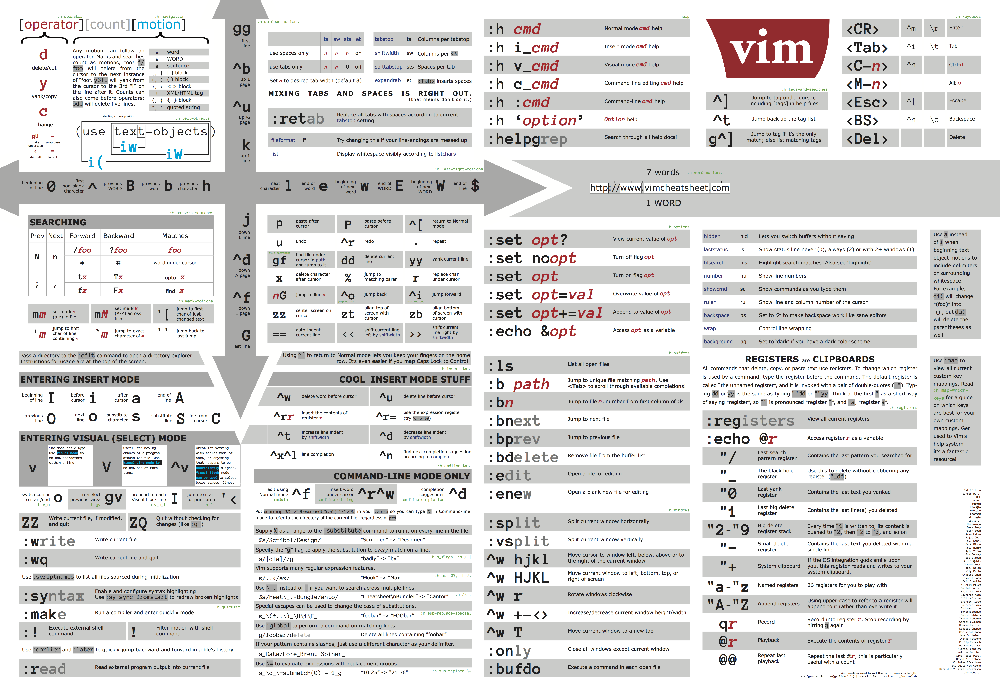

<!--
Author: Alexandre Ducobu
Date: Ven 12 jan 2018 19:14:14 CET
-->

# Cheat Sheet for _(Neo)_ vim

> To update your plugins _(if you're using the_ Plug _manager)_, the command is ```:PlugUpdate```

## Move inside a file

| Command               | Description                           |
|-----------------------|---------------------------------------|
| ```G```               | Jump to the last line of the file     |
| ```gg```              | Jump to the first line of the file    |
| ```^^```              | Jump to the start of the current line |
| ```$```               | Jump to the end of the current line   |
| ```3j``` or ```:+3``` | Jump by 3 lines down                  |
| ```3G``` or ```:3```  | Jump to the 3rd line                  |

## Change display

| Command      | Description                    |
|--------------|--------------------------------|
| ```zR```     | Open all folds                 |
| ```zM```     | Close all folds                |
| ```zA```     | Toggle all folds at the cursor |
| ```za```     | Toggle the fold at the cursor  |
| ```:retab``` | Adjust indent                  |

## Save and quit

| Command                | Description                    |
|------------------------|--------------------------------|
| ```:w```               | Save file without leaving vim  |
| ```ZZ``` or ```:wq```  | Save file while leaving vim    |
| ```ZQ``` or ```:q!```  | Leave vim without saving file  |
| ```:bd``` or ```,bd``` | Close file without leaving vim |

## Copy, Cut, Paste and Select

| Command     | Description                                      |
|-------------|--------------------------------------------------|
| ```yy```    | Copy the line at the cursor                      |
| ```dd```    | Cut the line at the cursor                       |
| ```3yy```   | Copy 3 lines from the line at the cursor         |
| ```3dd```   | Cut 3 lines from the line at the cursor          |
| ````p````   | Paste starting from the next line of the cursor  |
| ```"_dd```  | Delete the line at the cursor _(cut it in void)_ |
| ```"_d3j``` | Delete 3 lines down from the one at the cursor   |
| ```V3j```   | Select 3 lines down from the one at the cursor   |

## Search, etc.

| Command     | Description                              |
|-------------|------------------------------------------|
| ```/void``` | Go to the first occurence of _'void'_    |
| ```n```     | Go to the next occurence of _'void'_     |
| ```⇧ n```   | Go to the previous occurence of _'void'_ |

## Undo and Redo

| Command   | Description                                         |
|-----------|-----------------------------------------------------|
| ```u```   | Undo the last change _(can be used multiple times)_ |
| ```⌃ r``` | Redo the changes                                    |

## Open and Create files from vim

| Command              | Descritpion                                            |
|----------------------|--------------------------------------------------------|
| ```:e main.java```   | Open the _'main.java'_ from the current directory      |
| ```:new README.md``` | Create the _'README.md'_ file in the current directory |

## Buffers

| Command                                      | Description                                                   |
|----------------------------------------------|---------------------------------------------------------------|
| ```:e``` or ```:new````                      | Create a buffer                                               |
| ```:badd file```                             | Create a buffer for _'file'_ without opening it               |
| ```:ls```, ```:buffers``` or ```:files```    | List of all the existing buffers                              |
| ```:ls!```, ```:buffers!``` or ```:files!``` | List all the buffers including unlisted buffers               |
| ```:bd file``` or ```:4bd```                 | Close the 4th buffer or the one for the _'file'_              |
| ```:bd file1 file2 file3``` or ```:3,5bd```  | Close multiple buffers _(here 3)_                             |
| ```:bunload```                               | Hide the buffer but leave it in the buffer list               |
| ```:b file``` or ```:b 3```                  | Open the buffer from the list _(completion with_ ⇥ _works)_   |
| ```:split file```                            | Split window horizontally and load _'file'_                   |
| ```:vsplit file```                           | Split window vertically and load _'file'_                     |
| ```:⌃ w h```                                 | Go to the buffer at the **left** _(works with h, j, k and l)_ |

## NERDTree

| Command   | Description                           |
|-----------|---------------------------------------|
| ```⌃ n``` | Toggle the NERDTree                   |
| ```m```   | Bring up the NERDTree Filesystem Menu |
| ```a```   | Add a child node                      |

> To create a new file, you have to _Open NERDTree_ and _Enter its Filesystem Menu_.  
> Then _Add a new child node_ and finally _Enter the file/directory name_.

## Other

| Command                   | Description                                                         |
|---------------------------|---------------------------------------------------------------------|
| ```,tm```                 | Toggle the _table_mode_ _(has to be deactivated to save the file)_  |
| ```!!date```              | Write the current date and time at the next line from the cursor    |
| ```!!date v+3d```         | Write the date and time in 3 days at the newt line from the cursor  |
| ```!!date v-3d```         | Write the date and time 3 days ago at the newt line from the cursor |
| ```nvim -d file1 file2``` | Open two files in vim to compare them                               |

## Sources
- [DuckDuckGo's cheat sheet](https://duckduckgo.com/?q=vim+cheat+sheet&t=osx&iax=cheatsheet&ia=cheatsheet#)
- [Wikia vim blog](http://vim.wikia.com)
    - [Wikia _(Moving around)_](http://vim.wikia.com/wiki/Moving_around)
    - [Wikia _(Buffers)_](http://vim.wikia.com/wiki/Vim_buffer_FAQ)
- [Buffers](https://www.cs.oberlin.edu/~kuperman/help/vim/windows.html)


