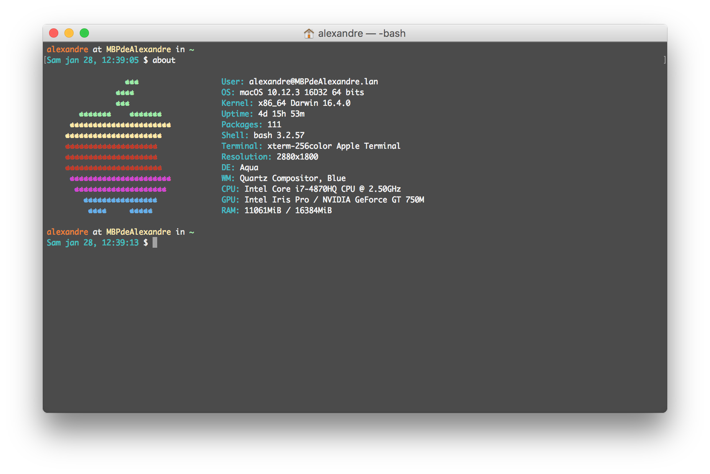

# My macOS configuration

You can find here all my configurations files.  

This repository contains, for now, [four bash files](bash_files/) and a [personnalized configuration and installation script](installation%20script/).  
Furthermore, I've added [a list of my apps](configs/MacApps.md) and [my Atom configuration](configs/Atom.md).

